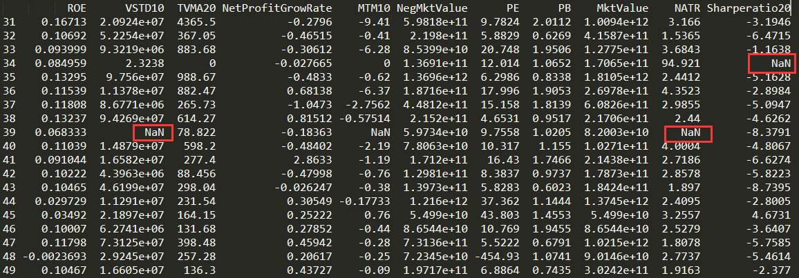
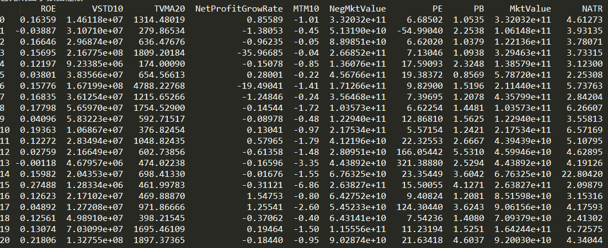
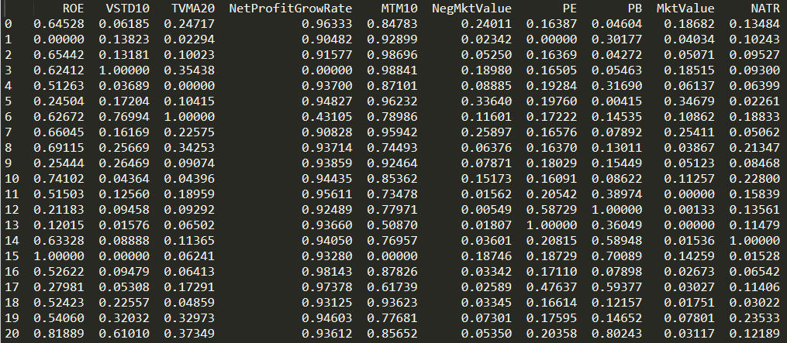
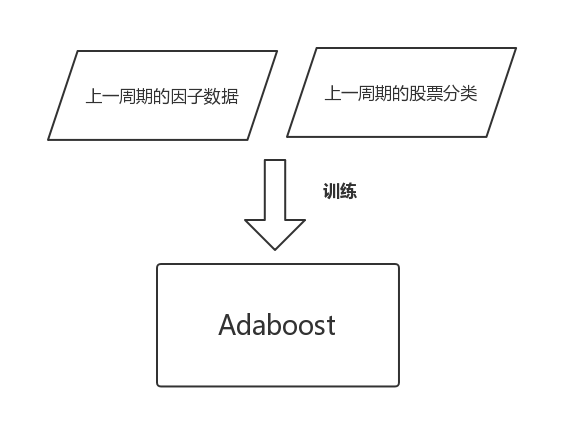
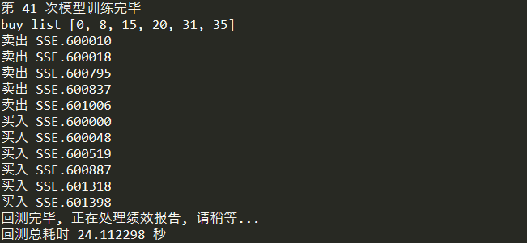
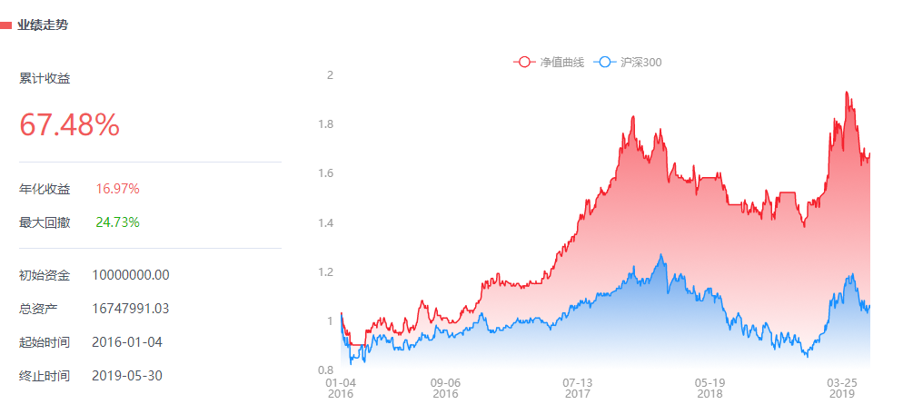
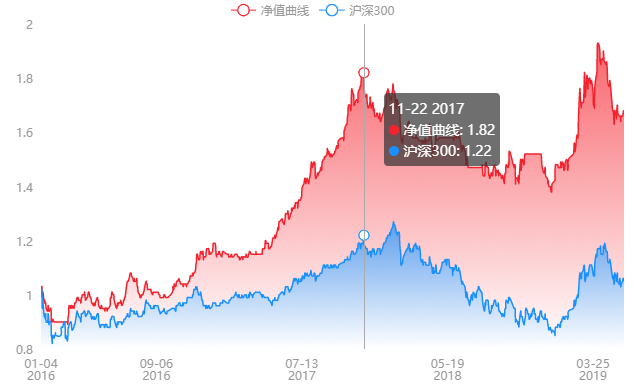
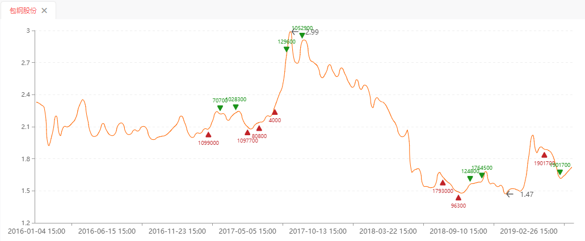
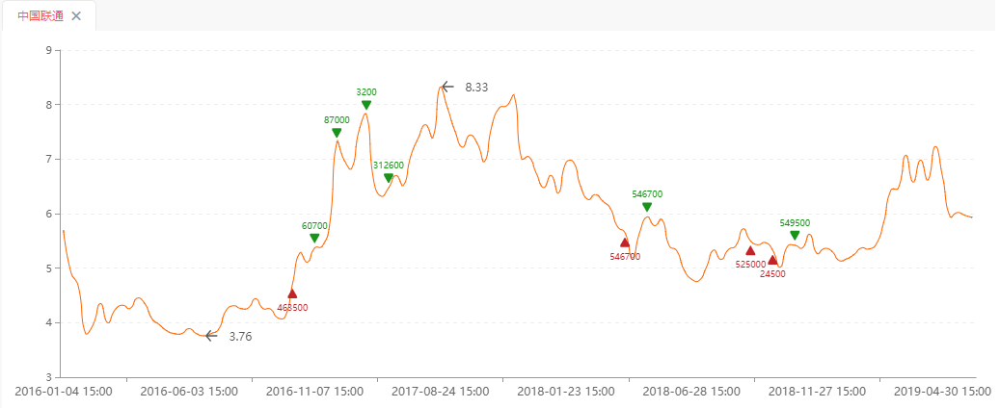

## 一、项目简介

​	2019泰迪杯B题，利用Adaboost模型对A股市场进行预测

​	首先通过Atrader平台获取上证50成份股2016年1月至2019年5月每月最后一个交易日的股票数据作为数据样本，这个时间段中包含了一轮牛市与熊市的交替，以此进行回测所得的结果更具说服力。通过查阅相关文献，本文首先选取了22个因子作为候选因子，总共分为八个大类，其中包括质量类因子、成才类因子、估值类因子、规模类因子、交易类因子、情绪类因子、技术指标类因子和WorldOuant Alphal01部分因子。通过IC值筛选从22个候选因子中选出10个最有效因子；然后引进AdaBoost算法对传统的多因子模型进行优化，逐步改进模型改并且使用Atrader平台进行回测；将AdaBoost算法与多因子模型结合并和传统多因子模型的选股效果对比，可以发现机器学习AdaBoost算法能增强传统多因子模型的选股效果，收益率显著增加。

## 二、数据集说明

 本项目所用的股票以及因子数据均来源于AutoTrader平台，详细API接口见点宽官网

## 三、项目算法简介

​	Boosting, 也称为增强学习或提升法， 能够将预测精度仅比随机猜度略高的弱学习器增强为预测精度高的强学习器。AdaBoost(Adaptive Boosting)(自适应增强）的自适应在于：前一个基本分类器被错误分类的样本的权值会增大，而正确分类的样本的权值会减小，并再次用来训练下一个基本分类器。同时，在每一轮迭代中，加入一个新的弱分类器，直到达到某个预定的足够小的错误率或达到预先指定的最大迭代次数才确定最终的强分类器。目的是从训练数据中学习一系列弱分类器或基本分类器，然后将这些弱分类器组合成一个强分类器。

​	本项目核心步骤是每次训练上一个交易周期的训练数据，然后将当前的因子数据输入模型进行预测分类，来获取收益率为正的股票代码，进行委托下单。每个交易周期训练一次模型，让模型能够适应市场的变化

## 四、程序结构与流程描述

**有效因子的选取**
  	这一步是多因子选股模型比较重要的步骤，选取了什么样的因子会直接影响模型的有效性。在选取因子的时候，我们尽可能多地考虑到了不同的角度，借鉴了之前的研究和学者的经验加入部分因子（见参考文献），并且根据市场的具体情况选择市场敏感度高的因子。

**数据预处理**
	在进行模型构建与分析之前，为了提高数据的质量，需要对数据进行预处理。数据预处理有多种方法，包括数据清理，数据集成，数据变换，数据归约等，本项目主要对数据进行以下预处理：
**缺失值处理**：在模型训练的时候，若出现某一个股票特征值缺失的情况，则使用后一个股票的数据进行填补，若填补完后仍存在缺失情况，说明本次获取的该特征值均为NaN值，直接删除该特征值。
**标准化处理**：由于不同因子所描述的对象单位不一样，那么可能导致不同因子数值差异很大，因此在进行因子测试与数据建模之前，需要对其进行标准化，常用的标准化方法有均值标准差法、最大最小标准化等，本文为了使数据特征更加鲜明, 采用了规范化方法
处理前：

处理后：

**定义预测标签**：将每个股票根据夏普率因子的正负进行标记，夏普率是一个可以同时对收益与风险加以综合考虑的指标，广泛运用于基金市场，目前已成为国际上用以衡量基金绩效表现的最为常用的一个标准化指标。
夏普比率可以帮助投资者在固定所能承受的风险下，追求最大的报酬；或在固定的预期报酬下，求最低的风险。这就是夏普比率的核心思想。夏普比率的计算非常简单，用净值增长率的平均值减无风险利率再除以基金净值增长率的标准差就可以得到基金的夏普比率
$Sharpe Ratio= $​$\frac{R_{p}-R_{f}}{\sigma_{p}}$

*Rp* 是策略的回报率，*Rf* 为无风险利率，*σp* 为收益率的标准差 
若当前股票的上个交易周期内夏普比率大于零，则将其标记为1，其他标记为0。

**因子有效性检验及筛选**
	本文采用因子IC值来检验因子的有效性，选取2016年1月至2018年1月的数据作为检验因子有效性的样本。
因子IC（信息系数）：即计算各个股票的因子暴露与各个股票下期收益率的之间的秩相关系数，一般而言，一个因子的IC值的绝对值高于0.02，便可以认为该因子有效性较好.
利用Atrader的因子分析平台API，我们可以列出各候选因子的IC值原始数据.

**Adaboost模型**

​	为了对机器学习算法进行训练，将股票池中的股票，根据夏普率的正负分为两组，夏普率为正的作为强势股，负的作为弱势股，对于强势股标记为1，弱势股标记为0，对Adaboost模型进行训练。

本项目核心步骤是每次训练上一个交易周期的训练数据，然后将当前的因子数据输入模型进行预测分类，来获取收益率为正的股票代码，进行委托下单。每个交易周期训练一次模型，让模型能够适应市场的变化

## 五、运行结果

程序每一个交易周期都会根据股票的预测值进行判断买入还是买入

运行过程图

**Adaboost****模型回测结果：

从结果可以看出，Adaboost改进的多因子模型效果很好，年化收益率高达17％，2016年投入1000万元，到了2019年已经盈利成为1674万元。

从牛市来看，该选股模型的盈利能力是市场平均的3-4倍

从熊市来看，该模型的最大回撤（最大回撤指的是最大亏损额）只有市场的一半左右，从收益曲线上观察更为直观，牛市时比大盘上升的更陡，熊市是下降的更缓，可见，该模型能够反映出一定的市场规律

   我们可以从具体股票的买入卖出来观察模型效果,此处以宝钢股份和中国联通为例，图6.4 6.5中红色代表买入，绿色代表卖出，能够观察到模型对股票的买入卖出时机把握的较为精准，这也能够反映出Adaboost模型的实用性与准确性。

